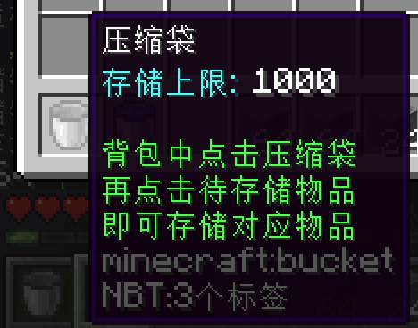
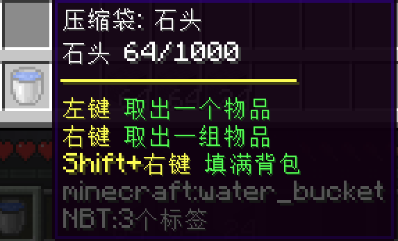
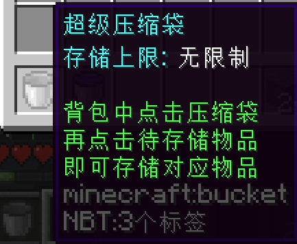
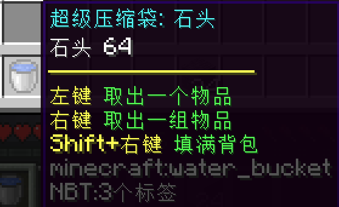

# 配置项

以默认配置为例:

```yaml
# 储物袋ID
StorageBagA:
  # 继承储物袋模板
  inherit: StorageBagTemplate
  sections:
    # 最大限制存储1000个物品(-1代表不限制)
    limit: 1000
    # 不存在限制时的显示文本
    noLimitString: 无限制
    # 存在限制时的显示文本
    LimitedString: <limit>
    # 不存在限制时的数量显示文本
    noLimitAmountString: <packedItemAmount>
    # 存在限制时的数量显示文本
    LimitedAmountString: <packedItemAmount>/<limit>
    # 未存储物品时的物品材质
    preMaterial: BUCKET
    # 已存储物品时的物品材质
    postMaterial: WATER_BUCKET
    # 未存储物品时的物品名称
    preName: §f压缩袋
    # 已存储物品时的物品名称, packedItemName代表被存储物品的物品名
    postName: '§f压缩袋: <packedItemName>'
    # 未存储物品时的物品Lore
    preLore:
      type: join
      list:
      - '§b存储上限: §f<limitString>'
      - ' '
      - §a背包中点击压缩袋
      - §a再点击待存储物品
      - §a即可存储对应物品
      separator: "\\n"
      prefix: '"'
      postfix: '"'
    # 未存储物品时的物品Lore, packedItemName代表被存储物品的物品名, packedItemAmount代表被存储物品的数量
    postLore:
      type: join
      list:
      - §f<packedItemName> §f<amountString>
      - '§e§m                     '
      - §e左键 §a取出一个物品             
      - §e右键 §a取出一组物品
      - §eShift+右键 §a填满背包
      separator: "\\n"
      prefix: '"'
      postfix: '"'
```

该储物袋未储存物品时形似:



已储存物品后形似:



当然, 这些配置项实质上都存在默认值, 因此你可以选择性地填写它们, 简化你的物品配置:

```yaml
StorageBagC:
  # 这一行可不能省略
  inherit: StorageBagTemplate
  sections:
    preName: §b超级压缩袋
    postName: '§b超级压缩袋: <packedItemName>'
```

该储物袋未储存物品时形似:



已储存物品后形似:



同时记住, 每个物品实质上都是一个NeigeItems物品, 因此你可以使用NeigeItems中的配置项, 自定义你的物品配置:

```yaml
StorageBagB:
  inherit: StorageBagTemplate
  sections:
    limit: 1000
  # 设置了物品的CustomModelData
  custommodeldata: 10000
  # 给物品添加了一些多级NBT
  nbt:
    itemsadder:
      namespace: strengthen
      id: bloodruby
```